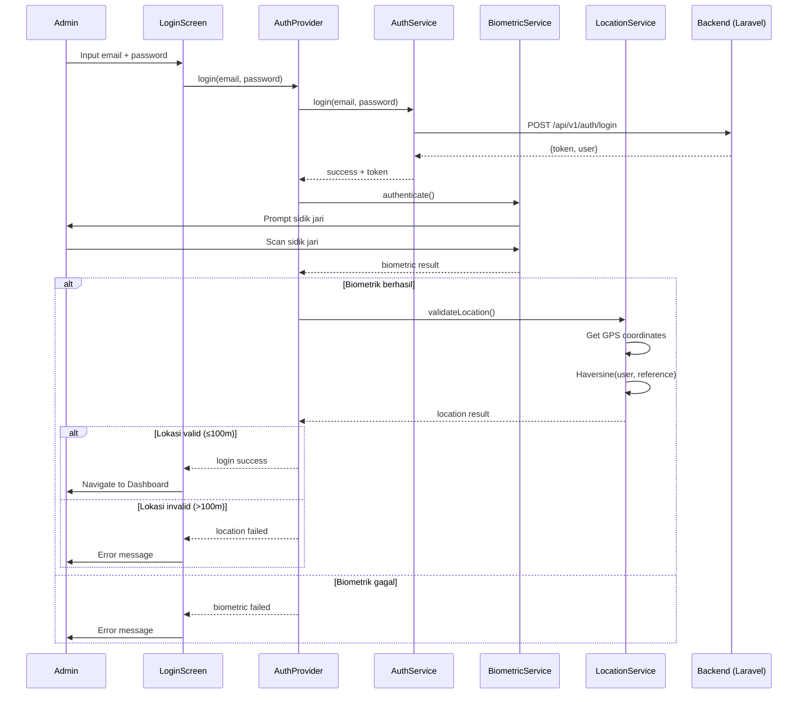

# Dokumen Perancangan: Autentikasi Biometrik dan Validasi Lokasi (LBS)

## Overview

Fitur ini menambahkan dua lapisan validasi tambahan pada alur login yang sudah ada (email + password via Laravel Sanctum). Setelah kredensial berhasil divalidasi oleh backend, aplikasi Flutter akan melakukan:

1. **Autentikasi biometrik** — memverifikasi sidik jari pengguna menggunakan paket `local_auth`
2. **Validasi lokasi GPS** — memastikan pengguna berada dalam radius 100 meter dari titik koordinat referensi menggunakan paket `geolocator` dan formula Haversine

Kedua validasi ini berjalan sepenuhnya di sisi Flutter (client-side). Backend tidak memerlukan perubahan karena hanya bertanggung jawab untuk validasi kredensial dan penerbitan token Sanctum.

### Keputusan Desain Utama

- **Client-side validation**: Biometrik dan GPS divalidasi di Flutter karena keduanya bergantung pada hardware perangkat lokal
- **Sequential flow**: Validasi berjalan berurutan (kredensial → biometrik → lokasi) untuk memberikan feedback yang jelas per tahap
- **Token diberikan setelah kredensial valid**: Token Sanctum diterbitkan setelah email/password valid, tetapi navigasi ke dashboard ditunda hingga biometrik dan lokasi lolos
- **Fail-fast approach**: Jika satu tahap gagal, proses dihentikan tanpa melanjutkan ke tahap berikutnya

## Architecture



### Arsitektur Layer

```
┌─────────────────────────────────────────────┐
│              Presentation Layer              │
│         LoginScreen (modified)              │
└──────────────────┬──────────────────────────┘
                   │
┌──────────────────▼──────────────────────────┐
│              State Management               │
│         AuthProvider (modified)             │
└──────┬───────────┬──────────────┬───────────┘
       │           │              │
┌──────▼───┐ ┌────▼─────┐ ┌─────▼──────────┐
│AuthService│ │Biometric │ │Location        │
│(existing) │ │Service   │ │Service         │
│           │ │(new)     │ │(new)           │
└───────────┘ └──────────┘ └────────────────┘
       │           │              │
┌──────▼───┐ ┌────▼─────┐ ┌─────▼──────────┐
│Laravel API│ │local_auth│ │geolocator      │
│(Sanctum)  │ │package   │ │package         │
└───────────┘ └──────────┘ └────────────────┘
```

## Components and Interfaces

### 1. BiometricService (baru)

File: `lib/services/biometric_service.dart`

```dart
/// BiometricService mengelola autentikasi sidik jari menggunakan local_auth.
class BiometricService {
  final LocalAuthentication _localAuth;

  BiometricService({LocalAuthentication? localAuth})
      : _localAuth = localAuth ?? LocalAuthentication();

  /// Memeriksa apakah perangkat mendukung biometrik dan memiliki sidik jari terdaftar.
  /// Returns: (isAvailable, errorMessage?)
  Future<({bool isAvailable, String? errorMessage})> checkBiometricAvailability();

  /// Menjalankan autentikasi sidik jari.
  /// Returns: (success, errorMessage?)
  Future<({bool success, String? errorMessage})> authenticate();
}
```

### 2. LocationService (baru)

File: `lib/services/location_service.dart`

```dart
/// LocationService mengelola validasi lokasi GPS menggunakan geolocator dan Haversine.
class LocationService {
  static const double referenceLatitude = -7.7533720;
  static const double referenceLongitude = 110.4290118;
  static const double toleranceRadiusMeters = 100.0;
  static const Duration gpsTimeout = Duration(seconds: 15);

  /// Memeriksa apakah layanan lokasi aktif dan izin diberikan.
  /// Returns: (isReady, errorMessage?)
  Future<({bool isReady, String? errorMessage, bool isPermanentlyDenied})> checkLocationPermission();

  /// Mengambil koordinat GPS dan memvalidasi jarak ke titik referensi.
  /// Returns: (isWithinRadius, distanceMeters, errorMessage?)
  Future<({bool isWithinRadius, double? distanceMeters, String? errorMessage})> validateLocation();

  /// Menghitung jarak antara dua titik koordinat menggunakan formula Haversine.
  /// Returns: jarak dalam meter
  double calculateHaversineDistance(
    double lat1, double lon1,
    double lat2, double lon2,
  );
}
```

### 3. AuthProvider (modifikasi)

File: `lib/providers/auth_provider.dart` — ditambahkan dependency ke BiometricService dan LocationService.

```dart
class AuthProvider extends ChangeNotifier {
  final AuthService _authService;
  final BiometricService _biometricService;
  final LocationService _locationService;

  // State tambahan
  LoginStep _currentStep = LoginStep.idle;
  
  /// Login flow lengkap: kredensial → biometrik → lokasi
  Future<bool> login(String email, String password);
}

enum LoginStep { idle, credentials, biometric, location, success, failed }
```

### 4. LoginScreen (modifikasi)

File: `lib/screens/login_screen.dart` — ditambahkan UI untuk menampilkan step indicator dan pesan error per tahap.

## Data Models

### LoginStep Enum

```dart
enum LoginStep {
  idle,        // Belum mulai
  credentials, // Sedang validasi email/password
  biometric,   // Sedang autentikasi sidik jari
  location,    // Sedang validasi lokasi GPS
  success,     // Semua tahap berhasil
  failed,      // Salah satu tahap gagal
}
```

### LoginResult

```dart
/// Hasil dari proses login multi-tahap.
class LoginResult {
  final bool success;
  final LoginStep failedAt; // Tahap yang gagal (jika ada)
  final String? errorMessage;

  const LoginResult({
    required this.success,
    this.failedAt = LoginStep.idle,
    this.errorMessage,
  });
}
```

### Konstanta Lokasi

```dart
/// Konstanta untuk validasi lokasi, didefinisikan di LocationService.
static const double referenceLatitude = -7.7533720;
static const double referenceLongitude = 110.4290118;
static const double toleranceRadiusMeters = 100.0;
static const Duration gpsTimeout = Duration(seconds: 15);
```

Tidak ada perubahan pada model `User` atau skema database backend. Semua data baru bersifat transient (hanya ada selama proses login).


## Correctness Properties

*Sebuah property adalah karakteristik atau perilaku yang harus berlaku di semua eksekusi valid dari sebuah sistem — pada dasarnya, pernyataan formal tentang apa yang seharusnya dilakukan sistem. Properties menjembatani antara spesifikasi yang dapat dibaca manusia dan jaminan kebenaran yang dapat diverifikasi mesin.*

### Property 1: Urutan Validasi dan Fail-Fast

*For any* login attempt, validasi HARUS berjalan dalam urutan ketat: (1) kredensial, (2) biometrik, (3) lokasi. Jika tahap ke-N gagal, tahap ke-(N+1) TIDAK BOLEH dieksekusi, dan hasil login harus menunjukkan tahap yang gagal.

**Validates: Requirements 1.1, 2.1, 3.1, 3.3**

### Property 2: Semua Tahap Berhasil Menghasilkan Login Sukses

*For any* login attempt di mana kredensial valid, biometrik berhasil, dan lokasi dalam radius, hasil akhir login HARUS bernilai sukses.

**Validates: Requirements 3.2**

### Property 3: Kebenaran Formula Haversine

*For any* dua pasang koordinat (lat1, lon1) dan (lat2, lon2) yang valid, fungsi `calculateHaversineDistance` HARUS menghasilkan jarak yang sama (dalam toleransi floating-point) dengan implementasi referensi formula Haversine: `2 * R * arcsin(sqrt(sin²((lat2-lat1)/2) + cos(lat1) * cos(lat2) * sin²((lon2-lon1)/2)))` di mana R = 6371000 meter.

**Validates: Requirements 2.2**

### Property 4: Threshold Validasi Lokasi

*For any* koordinat GPS pengguna, hasil `validateLocation` HARUS mengembalikan `isWithinRadius = true` jika dan hanya jika jarak Haversine ke titik referensi (-7.7533720, 110.4290118) ≤ 100 meter.

**Validates: Requirements 2.3, 2.4**

## Error Handling

### Strategi Error Per Tahap

| Tahap | Kondisi Error | Penanganan | Retry? |
|-------|--------------|------------|--------|
| Kredensial | Email/password salah | Tampilkan pesan "Email atau password salah" | Ya (otomatis, user coba lagi) |
| Biometrik | Sidik jari tidak cocok | Tampilkan pesan error, izinkan retry | Ya |
| Biometrik | Hardware tidak tersedia | Tampilkan pesan "Perangkat tidak mendukung biometrik" | Tidak (hentikan login) |
| Biometrik | Tidak ada sidik jari terdaftar | Tampilkan pesan "Daftarkan sidik jari di pengaturan perangkat" | Tidak (hentikan login) |
| Biometrik | User membatalkan | Kembali ke halaman login | Tidak |
| Lokasi | Di luar radius 100m | Tampilkan pesan "Anda berada di luar area yang diizinkan" | Ya |
| Lokasi | GPS tidak aktif | Tampilkan pesan "Aktifkan GPS untuk melanjutkan" | Ya |
| Lokasi | Izin ditolak | Tampilkan pesan + tombol ke Settings | Ya (setelah izin diberikan) |
| Lokasi | Izin ditolak permanen | Tampilkan pesan + arahkan ke pengaturan aplikasi | Ya (setelah manual enable) |
| Lokasi | Timeout 15 detik | Tampilkan pesan "Gagal mendapatkan lokasi, coba lagi" | Ya |

### Error State Management

```dart
/// AuthProvider menyimpan state error yang spesifik per tahap.
/// Ketika login gagal, _currentStep menunjukkan tahap yang gagal
/// dan _errorMessage berisi pesan yang sesuai.
///
/// UI membaca currentStep dan errorMessage untuk menampilkan
/// feedback yang kontekstual kepada pengguna.
```

### Prinsip Error Handling

1. **Fail-fast**: Jika satu tahap gagal, tahap berikutnya tidak dieksekusi
2. **Contextual messages**: Pesan error spesifik per tahap, bukan pesan generik
3. **Graceful degradation**: Jika hardware biometrik tidak ada, login dihentikan dengan pesan jelas
4. **Token cleanup**: Jika biometrik atau lokasi gagal setelah kredensial berhasil, token yang sudah diterima tetap disimpan (untuk menghindari re-authentication kredensial pada retry)

## Testing Strategy

### Unit Tests

Unit test fokus pada contoh spesifik dan edge case:

1. **BiometricService**
   - Test: `authenticate()` mengembalikan success ketika `local_auth` berhasil
   - Test: `authenticate()` mengembalikan error message ketika sidik jari gagal
   - Test: `checkBiometricAvailability()` mengembalikan false ketika hardware tidak ada
   - Test: `checkBiometricAvailability()` mengembalikan false ketika tidak ada sidik jari terdaftar
   - Edge case: User membatalkan biometric prompt

2. **LocationService**
   - Test: `validateLocation()` sukses dengan koordinat di dalam radius
   - Test: `validateLocation()` gagal dengan koordinat di luar radius
   - Test: `checkLocationPermission()` mendeteksi izin ditolak permanen
   - Edge case: GPS timeout setelah 15 detik
   - Edge case: GPS service tidak aktif

3. **AuthProvider (login flow)**
   - Test: Login sukses ketika semua tahap berhasil
   - Test: Login gagal di tahap kredensial tidak melanjutkan ke biometrik
   - Test: Login gagal di tahap biometrik tidak melanjutkan ke lokasi
   - Test: `currentStep` ter-update dengan benar di setiap tahap
   - Edge case: Cancellation di tahap biometrik

### Property-Based Tests

Library: **dart_quickcheck** (atau `glados` sebagai alternatif untuk Dart/Flutter)

Konfigurasi: minimum 100 iterasi per property test.

Setiap property test HARUS direferensikan ke property di design document:

1. **Feature: biometric-lbs-login, Property 1: Urutan Validasi dan Fail-Fast**
   - Generator: random combination of (credential_result, biometric_result, location_result) sebagai boolean
   - Assertion: jika step N gagal, step N+1 tidak pernah dipanggil; failedAt menunjukkan step yang benar

2. **Feature: biometric-lbs-login, Property 2: Semua Tahap Berhasil Menghasilkan Login Sukses**
   - Generator: random valid credentials, biometric success, location within radius
   - Assertion: login result selalu success

3. **Feature: biometric-lbs-login, Property 3: Kebenaran Formula Haversine**
   - Generator: random pairs of valid latitude (-90..90) dan longitude (-180..180)
   - Assertion: hasil `calculateHaversineDistance` sama dengan implementasi referensi (toleransi ≤ 0.01 meter)

4. **Feature: biometric-lbs-login, Property 4: Threshold Validasi Lokasi**
   - Generator: random koordinat GPS di sekitar titik referensi (mix dalam dan luar radius)
   - Assertion: `isWithinRadius == (haversineDistance <= 100.0)`

### Test Framework

- **Unit tests**: `flutter_test` (sudah ada di project)
- **Property-based tests**: `glados` package (Dart property-based testing library)
- **Mocking**: Manual mock classes (atau `mockito` jika ditambahkan)
- Setiap property test dikonfigurasi dengan minimum 100 iterasi
- Setiap test memiliki comment tag: `// Feature: biometric-lbs-login, Property N: [title]`
