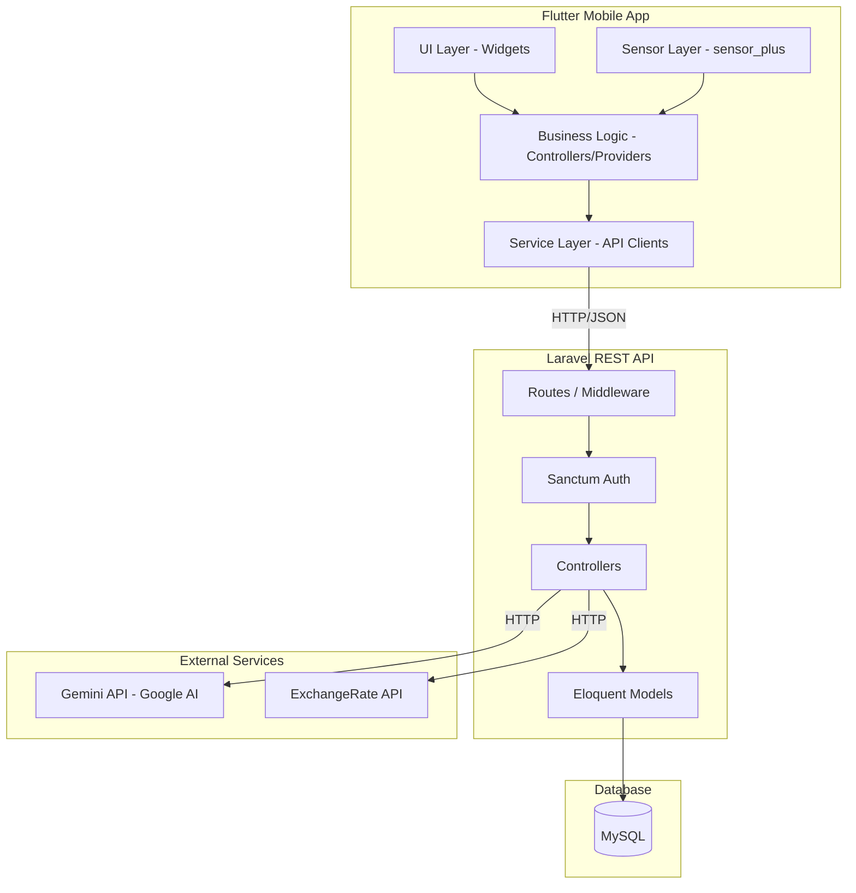
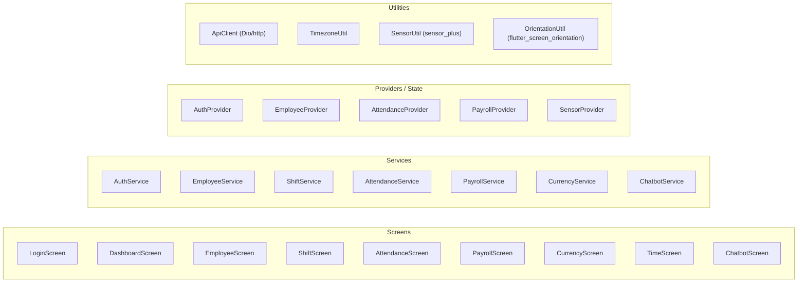
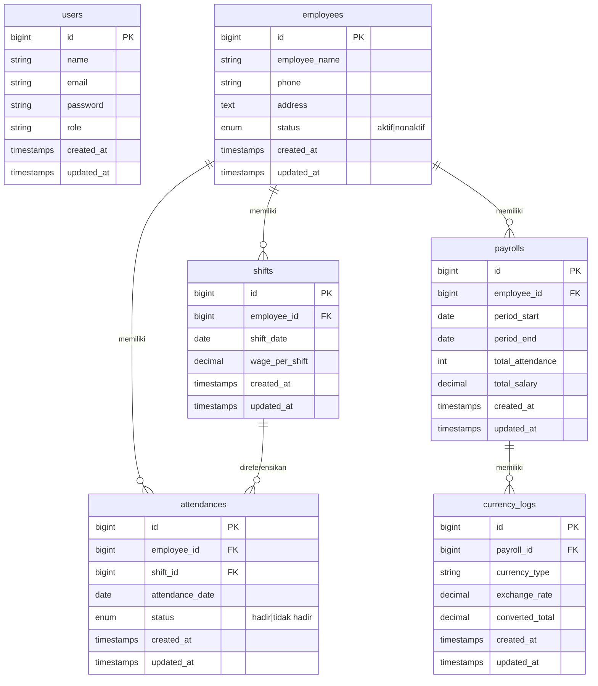

# Dokumen Perancangan: ERP Presensi dan Payroll

## Ikhtisar

Sistem ERP Presensi dan Payroll adalah aplikasi mobile berbasis Flutter yang terhubung ke REST API Laravel. Sistem ini dirancang untuk satu peran akses (Admin) dan mencakup sembilan modul utama: autentikasi, manajemen karyawan, manajemen shift, pencatatan presensi, penghitungan payroll, konversi mata uang, konversi zona waktu, simulasi chatbot AI, dan rotasi layar otomatis berbasis akselerometer.

Sistem ini merupakan proyek kampus dengan ruang lingkup terbatas namun memiliki fitur inovatif seperti integrasi Gemini API untuk simulasi chatbot dan penggunaan sensor perangkat untuk pengalaman mobile yang lebih baik.

---

## Arsitektur

Sistem menggunakan arsitektur **Client-Server** dengan pemisahan yang jelas antara lapisan presentasi (Flutter), lapisan logika bisnis (Laravel API), dan lapisan data (MySQL).



### Keputusan Arsitektur

- **Laravel Sanctum** digunakan untuk autentikasi token-based yang ringan dan cocok untuk aplikasi mobile.
- **Provider pattern** digunakan di Flutter untuk state management agar pemisahan UI dan logika bisnis terjaga.
- Konversi zona waktu dilakukan **di sisi Flutter** menggunakan package `timezone` tanpa memerlukan API eksternal, karena data zona waktu bersifat statis.
- Konversi mata uang dilakukan **di sisi Laravel** agar kurs yang diambil dapat dicatat ke database (`currency_logs`).
- Deteksi sensor (akselerometer dan giroskop) ditangani sepenuhnya **di sisi Flutter** menggunakan `sensor_plus`.

---

## Komponen dan Antarmuka

### Komponen Flutter



### Endpoint REST API Laravel

Semua endpoint diawali dengan `/api/v1`. Seluruh endpoint kecuali login memerlukan header `Authorization: Bearer {token}`.

#### Autentikasi

| Method | Endpoint | Deskripsi |
|--------|----------|-----------|
| POST | `/auth/login` | Login admin, mengembalikan token |
| POST | `/auth/logout` | Logout, mencabut token aktif |

#### Karyawan

| Method | Endpoint | Deskripsi |
|--------|----------|-----------|
| GET | `/employees` | Daftar semua karyawan |
| POST | `/employees` | Tambah karyawan baru |
| PUT | `/employees/{id}` | Perbarui data karyawan |
| DELETE | `/employees/{id}` | Hapus karyawan |

#### Shift

| Method | Endpoint | Deskripsi |
|--------|----------|-----------|
| GET | `/shifts` | Daftar semua jadwal shift |
| POST | `/shifts` | Tetapkan shift baru |
| DELETE | `/shifts/{id}` | Hapus jadwal shift |

#### Presensi

| Method | Endpoint | Deskripsi |
|--------|----------|-----------|
| GET | `/attendances` | Riwayat presensi (filter: `employee_id`, `date_from`, `date_to`) |
| POST | `/attendances` | Catat presensi baru |
| PUT | `/attendances/{id}` | Perbarui status presensi |

#### Payroll

| Method | Endpoint | Deskripsi |
|--------|----------|-----------|
| GET | `/payrolls` | Hitung & tampilkan payroll (filter: `period_start`, `period_end`, `search`) |
| GET | `/payrolls/download/report` | Unduh laporan payroll (PDF/Excel) |
| GET | `/payrolls/{employee_id}/slip` | Unduh slip gaji karyawan (PDF) |

#### Konversi Mata Uang

| Method | Endpoint | Deskripsi |
|--------|----------|-----------|
| POST | `/currency/convert` | Konversi IDR ke mata uang tujuan, simpan log |

#### Chatbot (Gemini)

| Method | Endpoint | Deskripsi |
|--------|----------|-----------|
| GET | `/chatbot/scenarios` | Daftar skenario simulasi |
| POST | `/chatbot/message` | Kirim pesan, terima balasan dari Gemini |
| POST | `/chatbot/feedback` | Minta evaluasi akhir sesi dari Gemini |

---

## Model Data

### Diagram ERD



### Struktur Payload API

#### Request: Login
```json
{
  "email": "admin@example.com",
  "password": "password123"
}
```

#### Response: Login Berhasil
```json
{
  "token": "1|abc123...",
  "user": { "id": 1, "name": "Admin", "email": "admin@example.com", "role": "admin" }
}
```

#### Request: Tambah Karyawan
```json
{
  "employee_name": "Budi Santoso",
  "phone": "08123456789",
  "address": "Jl. Merdeka No. 1",
  "status": "aktif"
}
```

#### Request: Catat Presensi
```json
{
  "employee_id": 1,
  "shift_id": 5,
  "attendance_date": "2025-07-15",
  "status": "hadir"
}
```

#### Request: Konversi Mata Uang
```json
{
  "payroll_id": 10,
  "amount_idr": 1000000,
  "target_currency": "USD"
}
```

#### Response: Konversi Mata Uang
```json
{
  "source_currency": "IDR",
  "target_currency": "USD",
  "exchange_rate": 0.000063,
  "converted_amount": 63.00,
  "log_id": 15
}
```

#### Request: Pesan Chatbot
```json
{
  "scenario_id": "angry_customer",
  "session_id": "uuid-sesi",
  "message": "Maaf atas ketidaknyamanannya, izinkan saya membantu."
}
```

#### Response: Pesan Chatbot
```json
{
  "reply": "Sudah terlambat 30 menit! Ini tidak bisa diterima!",
  "session_id": "uuid-sesi"
}
```

---

## Properti Kebenaran (Correctness Properties)

*Properti adalah karakteristik atau perilaku yang harus berlaku di seluruh eksekusi sistem yang valid — pada dasarnya, pernyataan formal tentang apa yang seharusnya dilakukan sistem. Properti berfungsi sebagai jembatan antara spesifikasi yang dapat dibaca manusia dan jaminan kebenaran yang dapat diverifikasi secara otomatis.*

### Properti 1: Kalkulasi Payroll Konsisten

*Untuk setiap* karyawan dan periode waktu yang valid, total gaji yang dihitung harus selalu sama dengan jumlah presensi berstatus "hadir" dikalikan Rp50.000, tanpa memandang urutan data presensi diproses.

**Memvalidasi: Kebutuhan 5.1, 5.2**

### Properti 2: Shift Unik per Karyawan per Tanggal

*Untuk setiap* karyawan, tidak boleh ada dua shift dengan tanggal yang sama tersimpan di database secara bersamaan.

**Memvalidasi: Kebutuhan 3.3**

### Properti 3: Validasi Input Karyawan

*Untuk setiap* string yang hanya terdiri dari karakter whitespace atau string kosong pada field wajib (nama, telepon, alamat), sistem harus menolak penyimpanan dan mengembalikan pesan validasi.

**Memvalidasi: Kebutuhan 2.3**

### Properti 4: Validasi Input Presensi

*Untuk setiap* permintaan pencatatan presensi tanpa `employee_id` atau `shift_id`, sistem harus menolak permintaan dan mengembalikan pesan validasi yang menjelaskan field yang wajib diisi.

**Memvalidasi: Kebutuhan 4.5**

### Properti 5: Filter Presensi Konsisten

*Untuk setiap* query filter presensi berdasarkan `employee_id` dan rentang tanggal, semua hasil yang dikembalikan harus memiliki `employee_id` yang sesuai dan `attendance_date` yang berada dalam rentang yang diminta.

**Memvalidasi: Kebutuhan 4.4**

### Properti 6: Konversi Mata Uang Round-Trip

*Untuk setiap* nilai IDR yang dikonversi ke mata uang tujuan lalu dikonversi kembali ke IDR menggunakan kurs yang sama, hasil akhir harus mendekati nilai IDR awal (toleransi pembulatan floating point).

**Memvalidasi: Kebutuhan 6.1, 6.3**

### Properti 7: Log Konversi Tersimpan

*Untuk setiap* konversi mata uang yang berhasil, sebuah entri harus tersimpan di tabel `currency_logs` dengan `payroll_id`, `currency_type`, `exchange_rate`, dan `converted_total` yang benar.

**Memvalidasi: Kebutuhan 6.5**

### Properti 8: Konversi Zona Waktu Konsisten

*Untuk setiap* pasangan zona waktu asal dan tujuan, mengkonversi waktu dari A ke B lalu dari B kembali ke A harus menghasilkan waktu yang sama dengan waktu awal (round-trip property).

**Memvalidasi: Kebutuhan 7.1, 7.2**

### Properti 9: Proteksi Rute Terautentikasi

*Untuk setiap* permintaan ke endpoint yang dilindungi tanpa token valid, sistem harus mengembalikan HTTP 401 dan tidak mengembalikan data apapun.

**Memvalidasi: Kebutuhan 1.4, 1.5**

### Properti 10: Payroll Periode Kosong

*Untuk setiap* periode yang tidak memiliki data presensi berstatus "hadir", sistem harus mengembalikan total gaji sebesar 0 dan menampilkan pesan informatif, bukan error.

**Memvalidasi: Kebutuhan 5.8**

---

## Penanganan Error

### Strategi Umum

- Semua error API dikembalikan dalam format JSON standar:
  ```json
  { "message": "Deskripsi error", "errors": { "field": ["pesan validasi"] } }
  ```
- HTTP status code digunakan secara konsisten: `200`, `201`, `400`, `401`, `403`, `404`, `422`, `500`.
- Flutter menampilkan `SnackBar` atau dialog untuk semua error yang diterima dari API.

### Error per Modul

| Modul | Kondisi Error | Penanganan |
|-------|--------------|------------|
| Auth | Kredensial salah | HTTP 401, tampilkan pesan di form login |
| Auth | Token kedaluwarsa | HTTP 401, redirect otomatis ke halaman login |
| Employee | Field wajib kosong | HTTP 422, tampilkan pesan per field |
| Employee | Hapus karyawan dengan data terkait | HTTP 409, tampilkan dialog konfirmasi |
| Shift | Shift duplikat | HTTP 409, tampilkan pesan shift sudah ada |
| Payroll | Periode tanpa data | HTTP 200 dengan `total = 0`, tampilkan pesan informatif |
| Currency | API kurs gagal | HTTP 503 dari Laravel, tampilkan pesan koneksi gagal di Flutter |
| Chatbot | Gemini API gagal | HTTP 502 dari Laravel, pertahankan sesi, tampilkan tombol coba lagi |
| Sensor | Sensor tidak tersedia | Tangkap exception di Flutter, nonaktifkan fitur sensor dengan graceful degradation |

---

## Strategi Pengujian

### Pendekatan Dual Testing

Sistem menggunakan dua pendekatan pengujian yang saling melengkapi:

1. **Unit Test / Integration Test**: Memverifikasi contoh spesifik, kasus tepi, dan kondisi error.
2. **Property-Based Test (PBT)**: Memverifikasi properti universal yang harus berlaku untuk semua input yang valid.

### Unit & Integration Testing

**Backend (Laravel - PHPUnit):**
- Test autentikasi: login valid, login invalid, logout, akses tanpa token.
- Test CRUD karyawan: tambah, edit, hapus, validasi field kosong.
- Test shift: penetapan shift, deteksi duplikat, penghapusan.
- Test presensi: pencatatan, pembaruan status, filter.
- Test payroll: kalkulasi dengan berbagai jumlah kehadiran, periode kosong.
- Test konversi mata uang: mock API eksternal, verifikasi log tersimpan.
- Test chatbot: mock Gemini API, verifikasi alur sesi.

**Frontend (Flutter - flutter_test):**
- Widget test untuk form login, form karyawan, form presensi.
- Test navigasi antar halaman setelah login/logout.
- Test tampilan error saat API gagal.

### Property-Based Testing

**Library yang digunakan:**
- Backend: `eris` (PHP) atau implementasi manual dengan PHPUnit `@dataProvider` untuk properti sederhana.
- Frontend: `dart_test` dengan `package:test` dan generator manual.

**Konfigurasi:** Minimum 100 iterasi per property test.

**Tag format:** `Feature: erp-presensi-payroll, Property {nomor}: {teks properti}`

#### Implementasi Property Test

**Properti 1 — Kalkulasi Payroll Konsisten**
```
// Feature: erp-presensi-payroll, Property 1: Kalkulasi Payroll Konsisten
// Untuk setiap N kehadiran acak (0–100), total_salary harus = N × 50000
forAll(integer(0, 100), (n) => {
    $attendances = generateAttendances(n, 'hadir');
    $result = PayrollCalculator::calculate($attendances, 50000);
    assert($result->total_salary === $n * 50000);
    assert($result->total_attendance === $n);
});
```

**Properti 6 — Konversi Mata Uang Round-Trip**
```
// Feature: erp-presensi-payroll, Property 6: Konversi Mata Uang Round-Trip
// Untuk setiap nilai IDR acak dan kurs acak, konversi A→B→A harus kembali ke nilai awal
forAll(positiveDecimal(), positiveDecimal(), (idr, rate) => {
    $converted = $idr * $rate;
    $backToIdr = $converted / $rate;
    assertApproximatelyEqual($idr, $backToIdr, epsilon: 0.01);
});
```

**Properti 8 — Konversi Zona Waktu Round-Trip**
```
// Feature: erp-presensi-payroll, Property 8: Konversi Zona Waktu Round-Trip
// Untuk setiap waktu acak dan pasangan zona waktu, konversi A→B→A harus menghasilkan waktu awal
forAll(randomDateTime(), randomTimezonePair(), (dt, pair) => {
    final converted = TimezoneUtil.convert(dt, pair.from, pair.to);
    final roundTrip = TimezoneUtil.convert(converted, pair.to, pair.from);
    expect(roundTrip, equals(dt));
});
```

**Properti 9 — Proteksi Rute Terautentikasi**
```
// Feature: erp-presensi-payroll, Property 9: Proteksi Rute Terautentikasi
// Untuk setiap endpoint yang dilindungi dan setiap token tidak valid, respons harus 401
forAll(protectedEndpoint(), invalidToken(), (endpoint, token) => {
    $response = $this->withToken($token)->get($endpoint);
    $response->assertStatus(401);
});
```
