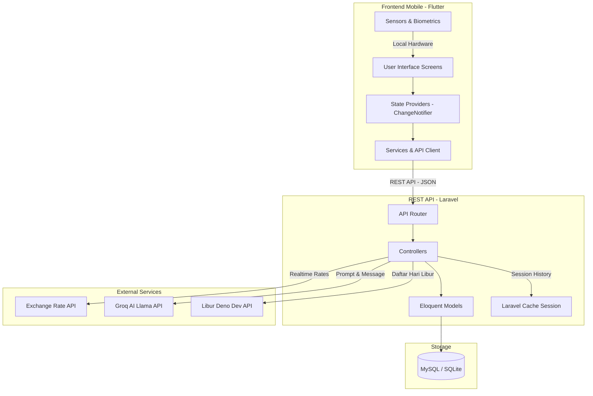

# Konteks Aplikasi ERP Presensi & Payroll

Dokumen ini berisi informasi menyeluruh tentang arsitektur, basis data, endpoint API, struktur kode, dan logika bisnis dari aplikasi **ERP Presensi & Payroll**. Dokumen ini dirancang secara terstruktur (*AI-Friendly*) agar memudahkan pemrosesan informasi dalam pembuatan laporan akademik maupun pengembangan lebih lanjut.

---

## 1. Metadata Proyek

| Informasi | Detail / Nilai |
| :--- | :--- |
| **Nama Aplikasi** | ERP Presensi & Payroll |
| **Mata Kuliah** | Teknologi Pemrograman Mobile (TPM) |
| **Semester** | Semester 8 |
| **Jenis Proyek** | Tugas Akhir Pengembangan Aplikasi |
| **Frontend Stack** | Flutter (Dart SDK ^3.11.1) |
| **Backend Stack** | Laravel (PHP ^8.1, Framework ^10.10) |
| **Database** | MySQL / SQLite (Laravel Migrations) |
| **Autentikasi** | Token-Based (Laravel Sanctum ^3.3) & Lokal (Biometrik Sidik Jari) |
| **Integrasi AI** | Groq API / Llama 3.1 8B (Layanan Pelanggan Kasir/Minimarket) |
| **API Kurs Eksternal** | Exchange Rate API (Realtime IDR Converter) |
| **API Hari Libur** | Libur Deno Dev API (Daftar Hari Libur Nasional Indonesia) |

---

## 2. Arsitektur Sistem

Aplikasi ini menggunakan arsitektur **Client-Server** dengan pola komunikasi REST API. Mobile app (Flutter) bertindak sebagai client yang melakukan interaksi dengan basis data melalui backend API (Laravel).



---

## 3. Struktur Direktori Proyek

### 3.1 Frontend (Flutter Workspace)
Berikut adalah susunan file utama pada direktori Flutter (`lib/`):
```text
lib/
├── main.dart                  # Titik awal aplikasi, inisialisasi route, & state provider
├── models/                    # Model data lokal (Dart classes)
│   ├── attendance.dart        # Model presensi karyawan
│   ├── employee.dart          # Model informasi karyawan
│   └── payroll.dart           # Model slip gaji
├── providers/                 # Pengelola state aplikasi (ChangeNotifier)
│   ├── attendance_provider.dart
│   ├── auth_provider.dart
│   ├── employee_provider.dart
│   ├── payroll_provider.dart
│   └── sensor_provider.dart   # Mengelola state sensor akselerometer
├── routes/
│   └── app_routes.dart        # Definisi nama route halaman/screen
├── screens/                   # Halaman-halaman UI aplikasi
│   ├── analytics_screen.dart  # Visualisasi performa AI K-Means (Admin-Only)
│   ├── attendance_screen.dart # Pencatatan presensi karyawan
│   ├── chatbot_screen.dart    # Simulasi interaksi AI training CS
│   ├── currency_screen.dart   # Kalkulator penukaran mata uang gaji
│   ├── dashboard_screen.dart  # Hub menu & profil ringkas
│   ├── employees_screen.dart  # Manajemen karyawan (Admin-Only)
│   ├── employee_form_screen.dart # Form tambah/edit karyawan
│   ├── kesan_pesan_screen.dart # Input kesan & pesan kuliah
│   ├── login_screen.dart      # Autentikasi email/password + biometrik
│   ├── payroll_screen.dart    # Perhitungan gaji dan ekspor PDF
│   ├── profile_screen.dart    # Manajemen informasi profil
│   ├── quiz_screen.dart       # Ujian simulasi layanan pelanggan
│   ├── shift_screen.dart      # Penugasan jadwal shift kerja
│   └── time_screen.dart       # Konverter zona waktu (WIB, WITA, WIT, dll)
├── services/                  # Kelas penghubung API dan perangkat keras
│   ├── api_client.dart        # Wrapper HTTP Client (Dio) dengan interceptor token
│   ├── analytics_service.dart # Handler API klasterisasi performa
│   ├── attendance_service.dart
│   ├── auth_service.dart
│   ├── biometric_service.dart # Handler local_auth sidik jari
│   ├── chatbot_service.dart
│   ├── currency_service.dart
│   ├── employee_service.dart
│   ├── geocoding_service.dart # Reverse geocoding koordinat GPS ke alamat
│   ├── location_service.dart  # Validasi GPS geofence menggunakan Geolocator
│   ├── payroll_service.dart
│   ├── profile_image_service.dart
│   ├── push_notification_service.dart # Notifikasi lokal
│   └── shift_service.dart
└── utils/                     # Fungsi utilitas pembantu
    ├── sensor_util.dart       # Pembaca sensor akselerometer untuk orientasi
    └── timezone_util.dart     # Pengolah zona waktu menggunakan package 'timezone'
```

### 3.2 Backend (Laravel Workspace)
Berikut adalah susunan file utama pada direktori Laravel (`backend/`):
```text
backend/
├── app/
│   ├── Http/Controllers/Api/  # Endpoint API Controllers
│   │   ├── AnalyticsController.php
│   │   ├── AttendanceController.php
│   │   ├── AuthController.php
│   │   ├── ChatbotController.php
│   │   ├── CurrencyController.php
│   │   ├── EmployeeController.php
│   │   ├── PayrollController.php
│   │   └── ShiftController.php
│   └── Models/                 # Eloquent ORM Models
│       ├── Attendance.php
│       ├── CurrencyLog.php
│       ├── Employee.php
│       ├── Payroll.php
│       ├── Shift.php
│       └── User.php
├── config/
│   └── services.php           # Konfigurasi API key (Groq & Exchange Rate)
├── database/migrations/       # Struktur skema basis data
├── resources/views/payroll/   # Template Blade untuk ekspor PDF
│   ├── report.blade.php       # Template PDF Rekap Payroll
│   └── slip.blade.php         # Template PDF Slip Gaji Karyawan
└── routes/
    └── api.php                # Definisi routing REST API (Prefix /api/v1)
```

---

## 4. Skema Basis Data

Berikut adalah relasi tabel database yang didefinisikan melalui Laravel Migrations.

### 4.1 Tabel `users`
Menyimpan kredensial login pengguna (admin atau karyawan).
```sql
CREATE TABLE users (
    id BIGINT UNSIGNED AUTO_INCREMENT PRIMARY KEY,
    name VARCHAR(255) NOT NULL,
    email VARCHAR(255) NOT NULL UNIQUE,
    password VARCHAR(255) NOT NULL,
    role VARCHAR(50) DEFAULT 'karyawan', -- 'admin' atau 'karyawan'
    employee_id BIGINT UNSIGNED NULL,     -- Hubungan ke tabel employees
    created_at TIMESTAMP NULL,
    updated_at TIMESTAMP NULL,
    FOREIGN KEY (employee_id) REFERENCES employees(id) ON DELETE SET NULL
);
```

### 4.2 Tabel `employees`
Menyimpan data detail profil fisik karyawan.
```sql
CREATE TABLE employees (
    id BIGINT UNSIGNED AUTO_INCREMENT PRIMARY KEY,
    employee_name VARCHAR(255) NOT NULL,
    phone VARCHAR(255) NOT NULL,
    address TEXT NOT NULL,
    status VARCHAR(50) DEFAULT 'aktif', -- 'aktif' atau 'nonaktif'
    created_at TIMESTAMP NULL,
    updated_at TIMESTAMP NULL
);
```

### 4.3 Tabel `shifts`
Menyimpan penjadwalan hari kerja dan tarif dasar per shift bagi karyawan tertentu.
```sql
CREATE TABLE shifts (
    id BIGINT UNSIGNED AUTO_INCREMENT PRIMARY KEY,
    employee_id BIGINT UNSIGNED NOT NULL,
    shift_date DATE NOT NULL,
    wage_per_shift DECIMAL(12, 2) DEFAULT 50000.00,
    created_at TIMESTAMP NULL,
    updated_at TIMESTAMP NULL,
    FOREIGN KEY (employee_id) REFERENCES employees(id) ON DELETE CASCADE,
    UNIQUE(employee_id, shift_date)
);
```

### 4.4 Tabel `attendances`
Menyimpan status kehadiran karyawan pada shift yang telah ditentukan.
```sql
CREATE TABLE attendances (
    id BIGINT UNSIGNED AUTO_INCREMENT PRIMARY KEY,
    employee_id BIGINT UNSIGNED NOT NULL,
    shift_id BIGINT UNSIGNED NOT NULL,
    attendance_date DATE NOT NULL,
    status VARCHAR(50) DEFAULT 'hadir', -- 'hadir' atau 'tidak hadir'
    created_at TIMESTAMP NULL,
    updated_at TIMESTAMP NULL,
    FOREIGN KEY (employee_id) REFERENCES employees(id) ON DELETE CASCADE,
    FOREIGN KEY (shift_id) REFERENCES shifts(id) ON DELETE CASCADE
);
```

### 4.5 Tabel `payrolls`
Menyimpan hasil perhitungan rekap gaji karyawan dalam suatu periode.
```sql
CREATE TABLE payrolls (
    id BIGINT UNSIGNED AUTO_INCREMENT PRIMARY KEY,
    employee_id BIGINT UNSIGNED NOT NULL,
    period_start DATE NOT NULL,
    period_end DATE NOT NULL,
    total_attendance INT NOT NULL,
    total_salary DECIMAL(14, 2) NOT NULL, -- total_attendance * wage_per_shift
    created_at TIMESTAMP NULL,
    updated_at TIMESTAMP NULL,
    FOREIGN KEY (employee_id) REFERENCES employees(id) ON DELETE CASCADE
);
```

### 4.6 Tabel `currency_logs`
Menyimpan riwayat penukaran nilai gaji IDR ke valuta asing via API.
```sql
CREATE TABLE currency_logs (
    id BIGINT UNSIGNED AUTO_INCREMENT PRIMARY KEY,
    payroll_id BIGINT UNSIGNED NULL,
    currency_type VARCHAR(10) NOT NULL, -- 'USD', 'EUR', 'GBP'
    exchange_rate DECIMAL(15, 10) NOT NULL,
    converted_total DECIMAL(18, 4) NOT NULL,
    created_at TIMESTAMP NULL,
    updated_at TIMESTAMP NULL,
    FOREIGN KEY (payroll_id) REFERENCES payrolls(id) ON DELETE SET NULL
);
```

---

## 5. Rujukan Endpoint API

Semua rute di bawah terdaftar dengan prefix `/api/v1/` dan dilindungi oleh Sanctum Middleware (kecuali login).

| Route | Method | Keterangan | Validasi Input | Autentikasi |
| :--- | :--- | :--- | :--- | :--- |
| `auth/login` | `POST` | Autentikasi user & cetak token | `email` (required, email), `password` (required) | Publik |
| `auth/logout` | `POST` | Revokasi token saat logout | - | Bearer Token |
| `auth/profile` | `PUT` | Memperbarui nama pengguna | `name` (required, string) | Bearer Token |
| `employees` | `GET` | Melihat daftar seluruh karyawan | - | Bearer Token |
| `employees` | `POST` | Membuat data karyawan baru (Admin) | `employee_name` (required, non-empty), `phone` (required), `address` (required), `status` ('aktif'/'nonaktif') | Bearer Token |
| `employees/{id}`| `PUT` | Memperbarui data karyawan (Admin) | Sama seperti POST | Bearer Token |
| `employees/{id}`| `DELETE`| Menghapus karyawan (Admin) | Dicek: Karyawan yang memiliki data kehadiran/payroll tidak boleh dihapus | Bearer Token |
| `shifts` | `GET` | Melihat seluruh penugasan shift | - | Bearer Token |
| `shifts` | `POST` | Membuat penugasan shift baru | `employee_id` (required, exists), `shift_date` (required, date), `wage_per_shift` (optional, default 50000) | Bearer Token |
| `shifts/{id}` | `DELETE`| Menghapus penugasan shift | - | Bearer Token |
| `attendances` | `GET` | Filter rekap presensi karyawan | `employee_id` (optional), `date_from` (optional), `date_to` (optional) | Bearer Token |
| `attendances` | `POST` | Mencatat status kehadiran baru | `employee_id` (required), `shift_id` (required), `attendance_date` (required), `status` ('hadir'/'tidak hadir') | Bearer Token |
| `attendances/{id}`| `PUT` | Mengubah status kehadiran | `status` (required, 'hadir'/'tidak hadir') | Bearer Token |
| `payrolls` | `GET` | Perhitungan & pembuatan slip gaji | `period_start` (required, date), `period_end` (required, date, >= period_start), `search` (optional) | Bearer Token |
| `payrolls/download/report` | `GET` | Download PDF Rekap Gaji (Admin) | `period_start` (required), `period_end` (required), `currency` (optional, default IDR), `timezone` (optional, default WIB) | Bearer Token |
| `payrolls/{employee_id}/slip` | `GET` | Download PDF Slip Gaji Karyawan | `period_start` (required), `period_end` (required), `currency` (optional), `timezone` (optional) | Bearer Token |
| `currency/convert` | `POST` | Melakukan konversi IDR ke USD/EUR/GBP | `payroll_id` (optional), `amount_idr` (required, numeric), `target_currency` (required, 'USD'/'EUR'/'GBP') | Bearer Token |
| `analytics/performance` | `GET` | Analisis performa kehadiran (K-Means/Fallback) | - | Bearer Token (Admin) |
| `chatbot/scenarios` | `GET` | Mengambil skenario roleplay CS | - | Bearer Token |
| `chatbot/message` | `POST` | Kirim chat simulasi ke AI Llama | `scenario_id` (required), `session_id` (optional), `message` (required) | Bearer Token |
| `chatbot/feedback` | `POST` | Meminta evaluasi & nilai AI atas chat | `session_id` (required) | Bearer Token |

---

## 6. Logika Utama dan Implementasi Fitur

### 6.1 Validasi Geofencing Presensi (Haversine Formula)
Untuk mencegah manipulasi presensi oleh karyawan, Flutter Client menghitung jarak koordinat GPS aktual ke koordinat kantor menggunakan **Formula Haversine**.

*   **Koordinat Referensi Kantor**: `Latitude = -7.7550938`, `Longitude = 110.4057171`
*   **Radius Toleransi**: 100 meter

#### Logika Matematika Haversine:
$$d = 2R \arcsin\left(\sqrt{\sin^2\left(\frac{\Delta\phi}{2}\right) + \cos(\phi_1)\cos(\phi_2)\sin^2\left(\frac{\Delta\lambda}{2}\right)}\right)$$
*Di mana:*
*   $R$ = Radius bumi (6,371,000 meter)
*   $\phi_1, \phi_2$ = Latitude titik ke-1 dan ke-2 dalam radian
*   $\Delta\phi$ = Selisih latitude ($lat_2 - lat_1$) dalam radian
*   $\Delta\lambda$ = Selisih longitude ($lon_2 - lon_1$) dalam radian

Jika hasil perhitungan $d \le 100$ meter, presensi disetujui. Jika $d > 100$ meter, presensi diblokir dan sistem memunculkan pesan kesalahan: *"Anda berada di luar area yang diizinkan"*.

### 6.2 Perhitungan Payroll Otomatis & Ekspor PDF
*   **Penyaringan & Penentuan Tanggal**: Perhitungan gaji dan filter periode penggajian didasarkan pada tanggal shift terjadwal (**`shift_date`**) yang terasosiasi dengan presensi karyawan, bukan tanggal pencatatan presensi (`attendance_date`).
*   **Rumus Payroll**: 
    Gaji dihitung per kehadiran dengan membedakan status hari pada tanggal shift:
    *   *Hari Kerja Biasa & Akhir Pekan (Sabtu/Minggu)*: Menggunakan tarif shift dasar (default Rp50.000,00 atau sesuai nilai `wage_per_shift` di tabel `shifts`). Sabtu dan Minggu tidak dianggap sebagai hari libur secara otomatis.
    *   *Hari Libur Nasional / Cuti Bersama (Resmi)*: Menggunakan tarif tetap sebesar **Rp100.000,00** per kehadiran (tidak dipengaruhi tarif dasar biasa).
*   **Integrasi Hari Libur (Libur Deno Dev API)**:
    Backend secara otomatis terintegrasi dengan API publik `https://libur.deno.dev/api` untuk melacak hari libur nasional Indonesia berdasarkan tahun shift (`year`). Untuk menghemat kuota dan mempercepat pemrosesan, daftar tanggal hari libur disimpan di cache Laravel (`Cache::remember`) selama **24 jam**. Pengecekan status libur untuk setiap presensi divalidasi langsung berdasarkan tanggal shift.
*   **Ekspor Dokumen**: Backend memanfaatkan library **DOMPDF** (`barryvdh/laravel-dompdf`) untuk memformat markup HTML (template blade) langsung menjadi lembar laporan PDF berkualitas tinggi.
*   **Konversi Valuta**: Nilai total gaji dikonversikan ke mata uang pilihan (`USD`, `EUR`, `GBP`) saat proses pembuatan PDF jika diminta.
*   **Waktu Cetak**: Laporan mencantumkan stempel waktu cetak sesuai zona waktu terpilih (WIB, WITA, WIT) yang dikirim oleh request client.

### 6.3 Chatbot Simulasi AI (Groq & Llama 3.1)
Digunakan sebagai sarana pelatihan pelayanan kasir (*customer service*) di toko kelontong.
1.  **Daftar Skenario**:
    *   `angry_customer` (Susu kedaluwarsa, ingin refund & sangat marah).
    *   `confused_customer` (Mencari letak pembersih lantai & info diskon member).
    *   `refund_request` (Tukar barang minyak goreng salah beli ke ukuran lain).
    *   `compliment_customer` (Memberikan pujian atas keramahan pelayanan kasir).
2.  **Manajemen Sesi & Cache**:
    Riwayat percakapan disimpan dalam cache Laravel (`Cache::get` / `Cache::put`) per `session_id` selama 1 jam. Hal ini menjaga konsistensi ingatan agen AI tanpa perlu database penyimpanan chat permanen.
3.  **Evaluasi Otomatis (Feedback)**:
    Setelah interaksi dirasa cukup, user dapat memicu evaluasi. Sistem akan merangkum riwayat percakapan tersebut, lalu mengirimkannya kembali ke AI dengan instruksi khusus (*system prompt* evaluator) untuk memberikan skor kualitas pelayanan skala 1-10 beserta kritik/saran membangun dalam bahasa Indonesia.

### 6.4 Sensor Fisik Akselerometer (Auto-Rotation)
Aplikasi memantau kemiringan orientasi layar secara manual berbasis hardware menggunakan sensor akselerometer perangkat Android/iOS (`sensors_plus`).
*   **Manajemen Siklus Hidup (Lifecycle Wrapper)**:
    Untuk menghemat konsumsi daya baterai gawai, pendeteksi sensor aktif hanya ketika aplikasi berada di depan layar (`resumed`). Pendeteksian dihentikan seketika saat aplikasi dipindahkan ke latar belakang (`paused` / `inactive` / `detached`).

### 6.5 Autentikasi Biometrik Lokal
Selain login kredensial standar (email dan sandi), client mengintegrasikan **Local Authentication** perangkat (`local_auth`).
*   Menghindari penginputan berulang kata sandi demi kenyamanan (*user experience*).
*   Mengecek status perangkat keras biometrik, ketersediaan sidik jari yang terdaftar di sistem operasi ponsel, lalu meluncurkan dialog sistem otentikasi biometrik bawaan.

### 6.6 AI Performance Analytics (K-Means Clustering)
Fitur analisis di Portal Admin yang mengelompokkan karyawan secara dinamis berdasarkan performa tingkat kehadiran.
1.  **Perhitungan Attendance Rate**:
    Tingkat kehadiran dihitung berdasarkan total shift terjadwal dan jumlah kehadiran dengan status `'hadir'`:
    $$\text{Attendance Rate} = \frac{\text{Hadir Count}}{\text{Total Shifts}} \times 100$$
2.  **Algoritma K-Means Clustering ($K=3$)**:
    *   **Inisialisasi**: Centroid awal ($c_1, c_2, c_3$) ditentukan dari nilai minimum, rata-rata, dan maksimum dari data kehadiran karyawan.
    *   **Asosiasi Cluster**: Setiap karyawan dikelompokkan ke cluster terdekat berdasarkan jarak absolut $|Rate - c_j|$.
    *   **Update Centroid**: Centroid baru dihitung sebagai nilai rata-rata (*mean*) dari seluruh anggota cluster tersebut.
    *   **Konvergensi**: Iterasi berhenti jika perubahan posisi centroid $< 0.01$ atau mencapai batas 100 iterasi.
    *   **Pemberian Label**: Tiga cluster diurutkan berdasarkan rata-rata nilainya untuk melabeli kelompok: **Kurang** (terendah), **Cukup** (sedang), dan **Baik** (tertinggi).
3.  **Metode Fallback (Rule-Based)**:
    Jika jumlah karyawan aktif $< 3$ atau seluruh karyawan memiliki nilai kehadiran yang seragam (misalnya semuanya 100%), K-Means tidak dapat beroperasi secara optimal. Sistem akan beralih secara otomatis ke klasifikasi manual berbasis batas tetap:
    *   **Baik**: $\text{Attendance Rate} \ge 85\%$
    *   **Cukup**: $60\% \le \text{Attendance Rate} < 85\%$
    *   **Kurang**: $\text{Attendance Rate} < 60\%$

